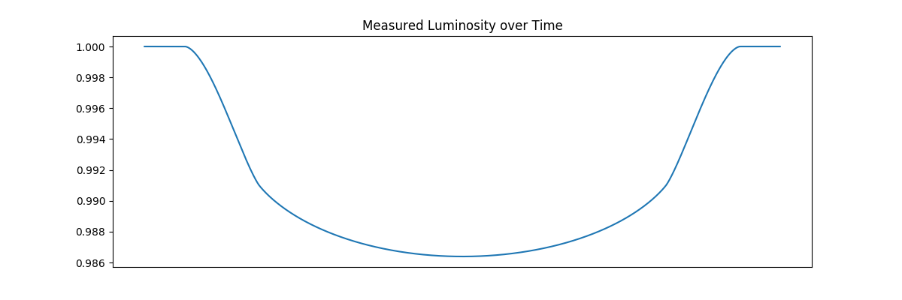

<p  align="center">  </p>
<h1 align="center">Stardust</h1>
<h4 align="center">"The Human Readable Password Generator"</h4>

<p align="center">
    <a href="LICENSE.md">
    
    <a href="https://paypal.me/wollemat">
    
</p>
      
<p align="center">
  <a href="#about">About</a> •
  <a href="#building">Building</a> •
  <a href="#deployment">Deployment</a> •
  <a href="#examples">Examples</a> •
  <a href="#contributing">Contributing</a> •
  <a href="#contributors">Contributors</a> •
  <a href="#donate">Donate</a> •
  <a href="#license">License</a>
</p>

## About

**Stardust** is a simulation that models the transit of an exoplanet in front of a distant star. 
The simulation takes the ingress of the planet, the egress of the planet and the limb darkening effect into account.

## Building

Before building Stardust please make sure that the following tools are up and running on your machine:

These instructions will get you a copy of the project up and running on your local machine for development and 
testing purposes. Stardust has only 2 requirements:

* A working installment of Python, development used Python 3.8 but almost any version should work.
* A working installation of Pipenv

Download the source code by running the following code in your command prompt:

```
$ git clone https://github.com/wollemat/stardust.git
```

Or simply grab a copy of the source code as a Zip file [here](https://github.com/wollemat/stardust/archive/master.zip) for the latest release and [here](https://github.com/wollemat/stardust/archive/develop.zip) for the *"bleeding edge"* version.

Building is as simple as running the following commands in the root of the project:

```
$ pipenv install
```

This will setup an Pipenv execution environment in which Stardust can be run.

## Deployment

The script has a few dependencies such as NumPy. This dependencies need to loaded into an environment and started. 
We could start an environment and run the script in that. 
However it is possible to run the script with a single command.

```
$ pipenv run python ./src/stardust.py DIRECTORY_NAME
```

Where `DIRECTORY_NAME` is the name of the directory where the files will be stored. 
The video file will be stored at `./data/DIRECTORY_NAME/transit.mp4`. 
The image file will be stored at `./data/DIRECTORY_NAME/transit.png`. 

Good luck and have fun!

## Examples

Some examples for you to get you on your way. Good Luck & Be Safe!

<p align="center">  </p>

<p align="center">  </p>

## Contributing

Feel free to help me out and make your mark on this project. 
No program is ever perfect and Stardust can always be improved upon.
If you feel like a feature is missing or you encounter a bug, please report it by creating an [issue](https://github.com/wollemat/stardust/issues/new).
Before doing this please read the [Code of Conduct](CODE_OF_CONDUCT.md) and the [Contributing](CONTRIBUTING.md) guidelines.
I look forward to working with you.

## Contributors

* **Frederik Christian Slothouber** - *Initial work* - [wollemat](https://github.com/wollemat)
* **Theo Min** - *Limb darkening effect*

## Donate

Please consider [donating](https://paypal.me/wollemat) if you found Stardust helpful in any shape or form. 
A small contribution comes a long way and is much appreciated.

## License

<p align="center">This project and its code are released under the MIT license. Please have a look at the <a href="LICENSE.md">LICENSE.md</a> for more details.</p>
<p align="center">Icon made by <a href="https://www.flaticon.com/authors/roundicons-freebies">Roundicons Freebies</a> from www.flaticon.com</p>
<p align="center">copyright © <a href="https://github.com/wollemat">wollemat</a></p>
